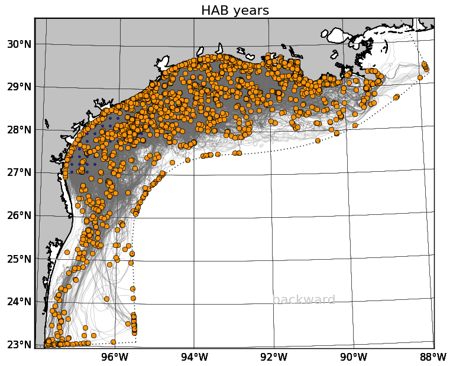

----------



----------

We run hindcast and forecast coastal ocean hydrodynamic models for the Texas-Louisiana shelf region and as conveniently as possible. As such, a lot of provide the model output publicly via a THREDDS server. We also use hindcast models of several estuaries such as Galveston Bay (via SUNTANS) and Copano Bay (ROMS).

We use a variety of computational tools. Many of our numerical simulations are run using the Regional Ocean Modeling System ([ROMS](https://www.myroms.org/)). We use the [NumPy](https://numpy.org/)  and [SciPy](https://scipy.org/) packages from the Python programming language for much of our analysis, and [matplotlib](https://matplotlib.org/) for our visualization. Recently, we began using [xarray](http://xarray.pydata.org/en/stable/) and [dask](https://dask.org), which has made our analyses much more efficient. In an effort to promote open science and scientific reproducibility, we use GitHub to store and share our scripts as well as to collaborate. We also use iPython notebooks as an easy way to display and share our work.

We are fans of many of the design ideas put forth by Edward Tufte and incorporate them as much as possible into our scientific figures.

Submesoscales and Near-Inertial Motions
=====

Near-inertial motions and submesoscales (1-10km) are ubiquitous and important features of the upper ocean. Recent work has shown that near-inertial motions (NIOs) can directly interact with submesoscales and upper ocean turbulence, but these interactions are poorly understood. This project seeks to create a unified dynamical description of near-inertial and submesoscale motions and their influence on turbulent mixing.

Copano Bay Physics and Salinity structure
=====

A high resolution hindcast model has been developed for Copano Bay, a broad, shallow, unsteady estuary along the Gulf Coast. Copano is an interesting system dynamically because the salinity structure inverts during low discharge periods, meaning the salinity in the estuary can be greater than at ocean's end or nearby coastal waters. Consequently, many of the timescales do not follow power laws in the literature. This project seeks to explain the drivers of the salinity structure and subsequently mixing.

TX-LA Hindcast Modeling
=====

A high resolution hindcast model has been run for the years 1993-Present. Model output is posted on a Thredds server and movies can be found online as well. Higher temporal resolution model output is also available.

TX-LA Forecast Modeling
=====

Images from a forecast simulation of the Texas-Louisiana shelf are available online.

Gulf of Mexico Forecast Modeling (Deprecated previous version of the forecast model)
=====

A forecasting model of the full Gulf of Mexico is maintained in PONG. NOAA's Oil Spill and Response GNOME uses the output in its spill predictions. Images are provided online.

Harmful Algal Bloom Modeling
=====

Harmful algal blooms (specifically red tides, in this research) occur periodically in the fall in Texas waters and can cause respiratory problems in fishermen and boaters and shut down recreation and shellfish harvesting in the affected areas. Biological effects alone do not adequately explain the rapidity with which harmful algal bloom events can occur. However, some recent research indicates that the circulation of the northern Gulf of Mexico can help to explain the occurrences.

Recent work with Rob Hetland, in collaboration with Lisa Campbell, is focused on better understanding the source of harmful algal blooms off the Texas coastline using a numerical model of the Texas and Louisiana shelf waters.

Oil Transport and Fate
=====

As part of the Gulf Integrated Spill Research (GISR) consortium, my group is one-way nesting a ROMS model of the Texas-Louisiana shelf in a Gulf of Mexico model, which will force a SUNTANS model of Galveston Bay. A near-field subsea blow-out model will determine the composition of oil and gas with depth, which will then be traced through the nested models to understand the fate of oil from an oil spill.

We are working on wrapping the particle tracking code TRACMASS in Python to make it easy to utilize with our model output, and by other researchers. We call this wrapped code system TracPy. You can read more about using TracPy in an online user manual.

Merrimack River Plume Modeling
=====

TAMU researchers are involved with modeling the Merrimack River in Massachusetts in the Merrimack River Mixing and Divergence Experiments (MERMADE) group.

Hypoxia Modeling
=====

Hypoxia, or low dissolved oxygen concentration, is a typical occurrence in the northern Gulf of Mexico and can lead to large fish kills. The causes of this problem are being studied in the Mechanisms Controlling Hypoxia (MCH) group.

Pearl River Forecast System
=====

The goal of this research is to develop a high-resolution forecast model in the Pearl River region of China. This forecast system is a fully operational ocean circulation forecast model on the South China Sea shelf for predicting temperature, salinity and currents. In the design and application plan, this system will be employed for investigating the coastal environments in the Pearl River Delta region including hypoxia, sediment distribution and transport, red tide forecast, pollutant tracking, and river plume evolution. So far, the real-time analysis and 7-day forecast of physical environment are operationally updated every day on the Pearl River Forecast Website.

Pearl River Hindcast Modeling
=====

This research, in collaboration with Dr. Tingting Zu, is focused on better understanding the structure and evolution of Pearl River and its comparison with Mississippi/Atchafalaya River system. The model domian covers the entire Pearl River region and the northern shelf of South China Sea with a resolution of 1800m in horizontal and 30 layers in vertical. The water depth ranges from 5m to more than 3000m. The model was initialized on January 1, 2014, with the initial and open boundary conditions created from the Copernicus-Marine. The surface heat, momentum and salt fluxes were provided by the ERA-Interium. The model provides 3-hourly output for temperature, salinity, sea level, and currents.

Particle Tracking Error
=====

Ongoing research, in collaboration with Dr. Kristen Thyng, is focused on the Lagrangian tracking errors due to temporal subsampling of numerical model output. Qualitatively, low temporal resolution will cause large tracking error, but we are trying to build a quantitative relation between those two factors. The preliminary result is that the missing energy ratio after subsampling will determine the tracking errors in a particle tracking simulation, which links the tracking error with the temporal resolution quantitatively. This research allows us to estimate better the errors in particle trajectories introduced by the choice of subsampling period which is helpful for properly setting up particle tracking simulations. The particle tracking tool is TracPy which is a Python wrapper of TRACMASS

Baroclinic Instability in River Plumes
=====

This research, under the advisement of Dr. Robert Hetland, is focused on better understanding the effects of wind forcing on suppression of baroclinic instabilities in far-field plume. Realistic simulation of Pearl River indicated that the submesoscale structures of plume instability disappear during the downwelling and upwelling seasons. So we hypothesize that the energy inputted into plume by the wind will enhance the mixing in the upper layer of the ocean and hence suppress the growth rate of the baroclinic instabilities. Results from the idealized simulation using the shelf strait model shows the suppression of baroclinic instabilities with the increasing of wind speed.

River Plume Prediction
=====

The goal of this study is to understand how the wind forcing mechanisms control the plume structure and evolution, which leads us to quantify temporal resolution of wind forcing required for accurate plume prediction. The primary finding is that the energy of high-frequency part of the wind is weak to control the mixing in a plume and hence insignificant to influence the plume structure and evolution. This research will help us to understand the importance of high-frequency information in the wind and to determine an appropriate temporal resolution of wind forcing for the plume simulation.

Yellow Seas Warm Current
=====

This study, under the guidance of Dr. Xiaopei Lin, is focused on the asymmetric structure of the continental shelf wave in the Yellow Sea and its impact on the westward shift of the Yellow Sea Warm Current (YSWC). YSWC is a winter intermittent current and exhibits the asymmetric response to the winter synoptic wind event. For the semienclosed double-shelf basin such as the Yellow Sea, the topographic connection at the end could cause the asymmetry of shelf wave. Our result shows that the evolution of the YSWC has a strong link with the propagation of the shelf wave, and the asymmetric characteristic of the upwind flow is caused by the asymmetric structure of the shelf wave because the current is constrained by the geostrophic balance.
