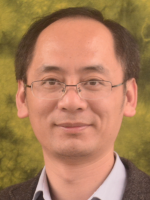



----------

Principle Investigator
======

### [Rob Hetland](http://pong.tamu.edu/~rob/)

Rob Hetland is a Professor in the Department of Oceanography at Texas A&M University. His research is focused on numerical simulation of flow in estuarine, coastal, and continental shelf environments; applications include examining plankton bloom dynamics, formation and destruction of continental shelf hypoxia, and real-time surface current forecasting.

Researchers
======
### [Kristen Thyng](http://kristenthyng.com/)

Kristen attended Whitman College for her bachelor degree in physics, graduating in 2005, before headed back to Seattle where she is from to attend the University of Washington. There, she studied applied mathematics for her masters degree (2007), then earned her PhD in mechanical engineering in 2012. She joined PONG in 2012 and is now an Assistant Research Professor.

### [Dajiro Kobashi](https://ocean.tamu.edu/people/profiles/research-staff/kobashidaijiro.html)

DJ moved to the United States to pursue a doctoral degree at LSU after he completed his masters degree from Tokai University in Japan. He is interested in coastal dynamics and its links to ecosystems and human activities. He joined PONG in February 2014 after he worked at NOAA in DC and then spent 4 years in Australia where he studied climate adaptation and coastal physical processes (internal tides and mixing in shallow coastal waters) by means of field measurements and numerical modeling.

### [Steven Baum](https://ocean.tamu.edu/people/profiles/research-staff/baumsteve.html)

Beer

Students
======

### [Tianxiang 'Ronnie' Gao](https://ocean.tamu.edu/people/profiles/students/gaotianxiang.html)

Ronnie is a third year PhD student who received his B.S. in oceanography from Ocean University of China in 2015 and his M.S. in physical oceanography in 2018. Currently, his research focuses on numerical modeling of Copano Bay, an estuary along the Gulf Coast. His research seeks to understand the drivers of mixing and the salinity structure.

### [Dylan Schlichting](https://ocean.tamu.edu/people/profiles/students/schlichtingdylan.html)

Dylan is a first year PhD student who received his B.S. in Civil Engineering from the University of Maine in 2019. His research focuses on developing the total exchange flow analysis framework, which tracks water mass circulation in salinity coordinates, to the coastal ocean. He is also interested in estuarine physics and has participated in the Copano Bay project by using total exchange flow and salinity variance to characterize the salinity structure.

Alumni
======

### [Veronica Ruiz Xomchuck](https://vrx-.github.io)

Veronica is now a postdoc and Florida Atlantic University.

### [Lixin Qu](https://lixinqu.github.io/)

Lixin is now a postdoc at Stanford University.

Arthur Ramos

Arthur is now a junior research engineer, currently working in Europe.

### [Hui Wu](http://english.sklec.ecnu.edu.cn/Staff/WuHui)

Hui is now a professor at the State Key Laboratory of Estuarine and Coastal Research,
East China Normal University

Tingting Zu

Tingting is back at the South China Sea Institute of Oceanology, Chinese Academy of Sciences as an Associate Research Professor.

Wenxia Zhang

Wenxia is now a postdoc professor at the State Key Laboratory of Estuarine and Coastal Research,
East China Normal University

### [Zhaoru Zhang](http://ioo.sjtu.edu.cn/en/szTeachers/3589.html)

Zhaoru is now an Associate Professor at Shanghai Jiao Tong University.

Kelly Cole

Kelly Cole is now an Assistant Research Professor in the Civil and Environmental Engineering Department at the University of Maine.
